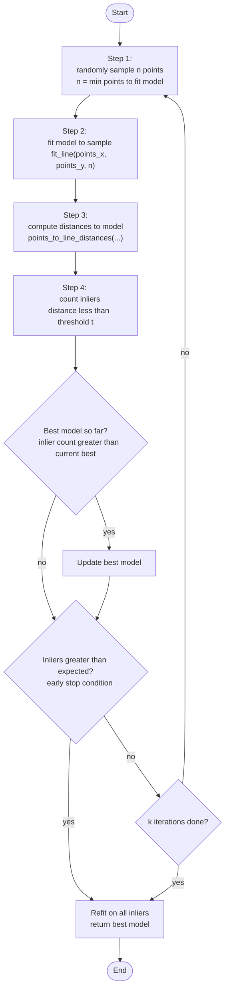

# Research Paper
* Name: Arsh Singh
* Semester: Spr 2026
* Topic: Random Sample Consensus (RANSAC) Algorithm

## Introduction
<!-- 
- What is the algorithm/datastructure?
- What is the problem it solves?
- Provide a brief history of the algorithm/datastructure. (make sure to cite sources)
- Provide an introduction to the rest of the paper. 
-->

The Algorithm that I want to focus on is called Random Sample Consesus (RANSAC). The method was introduced by Martin Fischler and Robert Bolles in 1981 [1]. It is a method for fitting a predetermined model to experimental data with sizeable number of outliers or noise.

<!-- Motivate the discussion with an example create a noisy line genarator over three different graphs with different but over lapping ranges of x -->
To motivate a good idea of the problem this algorithm solves, its usefulness and effectiveness, I will use a toy example to show how one of most popular fitting models - the least squares model is not robust to outliers.

For the sake of the following few paragraphs, assume that we are assigned the task of stitching the two graphs together and then deduce the true underlying model that created the data (apart from the noise). It is known that the following two graphs are built from the same linear model, but over different ranges of $x$ and are noisy with two possible kinds of errors: random noise (zero mean) and heavy-tailed noise (also mean zero). But there is no appreciable range of $x$ with only systematic bias. RANSAC assumes that within the data there are some clean points that lie within threshold distance of the correct model's prediction.

RANSAC inverts the logic of least squares: instead of fitting all the data first and cleaning up afterward, it starts with the smallest possible sample, finds a model, then recruits only the points that agree with it.

<!-- Formal Definition -->
The RANSAC paradigm is more formally stated [1] as follows.

**Given**: a model that requires a minimum of $n$ data points to instantiate its free parameters and a set of data points $P$ such that the number of points in $P$ is greater than $n$; $(size(P)\ge n)$.

1. Randomly select a subset $S1$ of $n$ data points from $P$ and instantiate the model. Use the instantiated model $M1$ to determine the subset $S1*$ of points in $P$ that are within some error tolerance of $M1$. The set $S1$* is called the consensus set of $S1$.

2. If $size(S1*)$ is greater than some threshold $t$, which is a function of the estimate of the number of gross errors in $P$, use $S1*$ to compute (possibly using least squares) a new model $M1*$.

3. If $size(S1*)$ is less than $t$, randomly select a new subset $S2$ and repeat the above process.

4. If, after some predetermined number of trials, no consensus set with $t$ or more members has been found, either solve the model with the largest consensus set found, or terminate in failure.

RANSAC has three parameters that must be configured: the error tolerance that decides whether a point fits a model, the number of random subsets to sample, and a consensus threshold that determines when enough points agree to declare a model correct.

<!-- [Show example of location determination - the one in the paper.] -->
The original paper demonstrated the application of RANSAC in *location determination problem* in computer vision. Today, RANSAC (Random Sample Consensus) is one of the most widely used tools for outlier rejection and data fitting, particularly in 2-D image stitching and structure from motion. The method has now been applied to a wide array of other problems [2, 3, 4]. I will disuss these in the section [Applications](#application). 

The rest of the paper is organized as follows: 

In the next section, [Analysis of Algorithm/Datastructure](#analysis-of-algorithmdatastructure), I will present the theoretical analysis of the RANSAC algorithm tryting to fit a linear and a quadratic model. [Maybe: I will also generalize this to a k-neighbors classification problem.] I will present the time and space complexity in the case of the specified models. 

In the section [Empirical Analysis](#empirical-analysis), I will present the empirical run time of the methods I implement in Python [Maybe: and C]. I will do a comparative analysis based on the models and the three variables for RANSAC. 

In the section [Application](#application) I will take a deeper dive into the various applications of RANSAC. 

In the section [Implementation](#implementation) I will present code snippets of my final implementation [maybe C, else Python]. I willdo a walk through and present a commentary on my design choices.

In conlusion, I will present a [Summary](#summary) of my findings and lessons I learnt.

## Analysis of Algorithm/Datastructure 
<!-- 
Make sure to include the following:
 - Time Complexity
 - Space Complexity
 - General analysis of the algorithm/datastructure
 - [Linear model]
 - [Quadratic model]
 - [Classification in n groups]
-->

## Empirical Analysis
<!-- 
- What is the empirical analysis?
- Provide specific examples / data.

HIGHLIGHTS:
1. Abstracting away from image complexities by using 2-D points instead of pixels. 
2. Keeping cartesian points also allows me to represent my analysis using simple and easy to interpret graphs.
3. 
-->

## Application
<!-- 
- What is the algorithm/datastructure used for?
- Provide specific examples
- Why is it useful / used in that field area?
- Make sure to provide sources for your information.
-->

RANSAC (Random Sample Consensus) is one of the most widely used tools for outlier rejection and data fitting, particularly in image stitching and structure from motion. Allow me to motivate its need and define image stitching. 

Many real-world computer vision tasks require a field of view far wider than what a single camera can capture. Many smart-phone owners may be familiar with the features of camera such as panoramic imaged, and video stabilization. Image stitching is also needed in industrial applications such as satellite and aerial imaging, medical imaging, autonomous navigation, and augmented reality — anywhere a spatial context is needed that a single image cannot provide.

In image stitching, the goal is to align two or more overlapping images by estimating a geometric transformation — such as a homography — that maps points from one image to corresponding points in another. This requires finding reliable feature correspondences between images. However, automated feature matching is inherently noisy: many matched point pairs will be incorrect, either due to repetitive textures, illumination differences etc. These incorrect matches, or outliers, is exactly what are handled gracefully and efficiently by RANSAC.

## Implementation
<!-- 
- What language did you use?
- What libraries did you use?
- What were the challenges you faced?
- Provide key points of the algorithm/datastructure implementation, discuss the code.
- If you found code in another language, and then implemented in your own language that is fine - but make sure to document that.

HIGHLIGHTS:

1. Abstracting away from image complexities by using 2-D points instead of pixels. 
2. Keeping cartesian points also allows me to represent my analysis using simple and easy to interpret graphs.
3.  
-->

Salient Design Decisions:

Python:
* C correspondence:
  * separate `data_x` and `data_y` arrays
  * functions that modify these in-place
  * all functions return -1 for error and 0 for success 
  * use only rand() 
  * do not use any other python packages - create gaussian noise manually using Box-Muller[5]

* Separate lists of x and y rather than tuples for mutability.
* `return_array` layout for ransac() with an eye for a future C struct
* Different kind of noise as separate functions to allow testing the efficacy of RANSAC with different kind of errors. 
* Using Box-Muller for gaussian noise [5].
* Why laplace noise?
  * Gaussian:  tails decay as exp(-x²)
  * Laplace:   tails decay as exp(-|x|), slower decay and heavier tails
  * The Laplace distribution looks like two exponential curves back to back, centered at a mean (0 in case of noise).
  * noise drawn from Laplace distribution has a higher probability of generating points far from the mean than Gaussian with the same scale. This makes it a good model for measurement errors that occasionally produce large deviations — more realistic than pure Gaussian.
* `fit_line` uses least squares - write formulae
* `points_to_line_distances` uses geometric (perpendicular) distance - write formula

## Summary
<!-- 
- Provide a summary of your findings
- What did you learn?
-->

## LLM Use Disclosure 
I did not any LLM to write any part of the code. I implemented my codes using pseudocodes presented in the texts in the reference section. I used MS Word for checking the report for syntax and grammar.

Claude: I used Calude for planning a 4-week time-line. I also used Claude to add doc strings at the end. 

Google Gemini: I used Google Gemini to look up many unknown terms when I encountered them in the text books.

## References

[1] Fischler, M. A. and Bolles, R. C. 1981. Random sample consensus: a paradigm for model fitting with applications to image analysis and automated cartography. Commun. ACM 24, 6 (June 1981), 381–395. https://doi.org/10.1145/358669.358692.

[2] Szeliski, R. 2022. Computer Vision: Algorithms and Applications (2nd ed.). Springer. ISBN 978-3-030-34371-2. https://doi.org/10.1007/978-3-030-34372-9.

[3] Davies, E. R. 2012. Computer and Machine Vision: Theory, Algorithms, Practicalities (4th ed.). Academic Press. ISBN 978-0-12-386908-1.

[4] Richard Hartley and Andrew Zisserman. 2004. Multiple View Geometry in Computer Vision. Cambridge University Press.

[5] Box, G. E. P. and Muller, M. E. 1958. A note on the generation of random normal deviates. The Annals of Mathematical Statistics 29, 2, 610–611.

<!-- Time Line
Days 1-3  (now-Apr 5):   finish generate.py + model.py
Days 4-6  (Apr 6-8):     ransac.py + evaluate.py
Days 7-9  (Apr 9-11):    end-to-end test + experiments
Days 10-12(Apr 12-14):   empirical analysis + plots
Days 13-15(Apr 15-17):   report writing + cleanup

Good to do:
Days 13-15(Apr 18-20):   Translate to C
Days 10-12(Apr 21-):   empirical analysis + plots
Days 13-15(Apr 15-17):   report writing + cleanup

-->