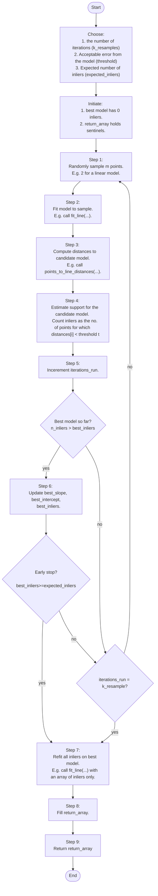
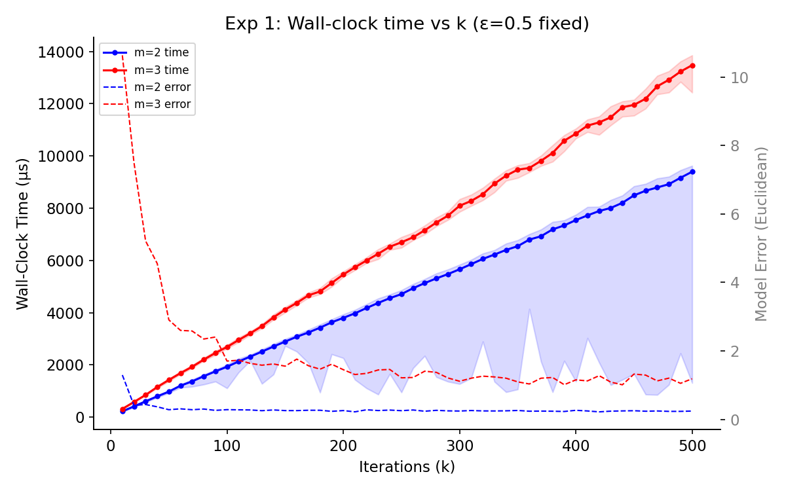
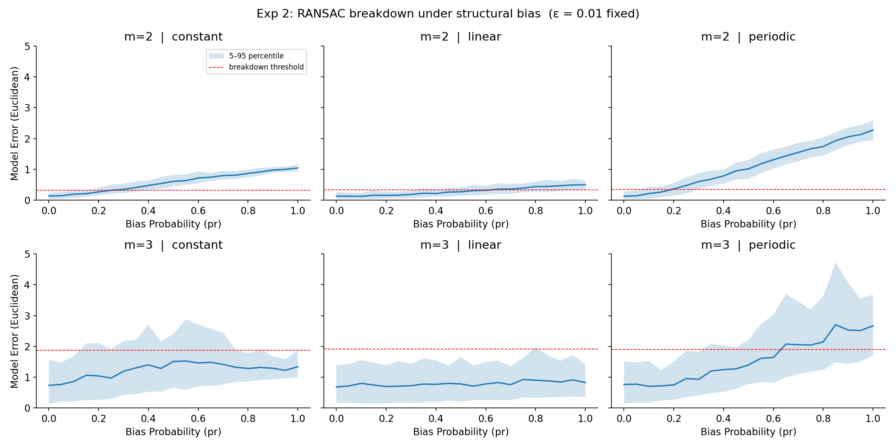
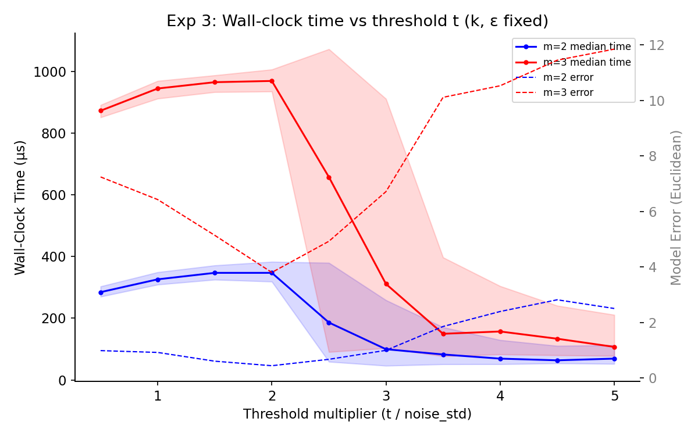
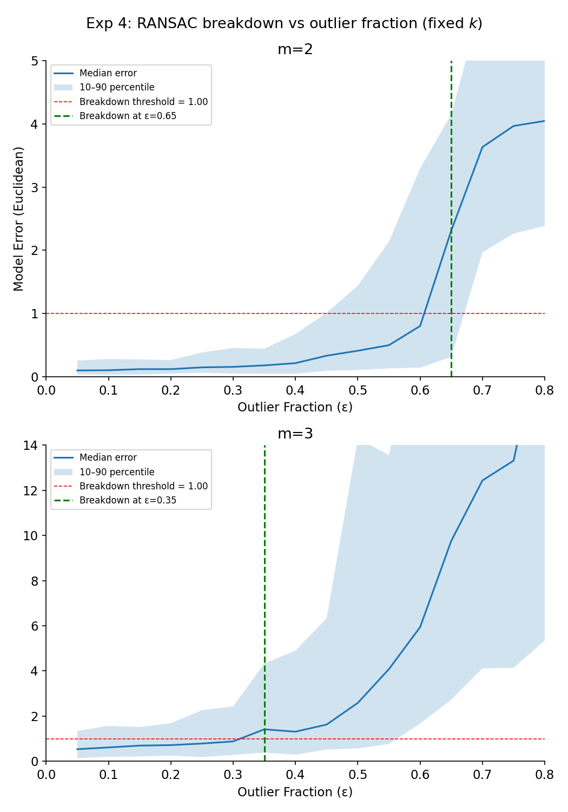
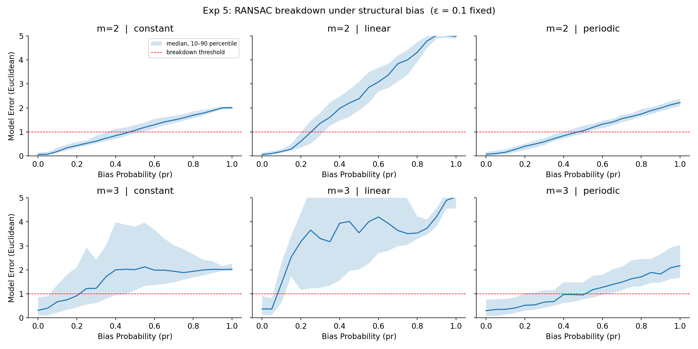
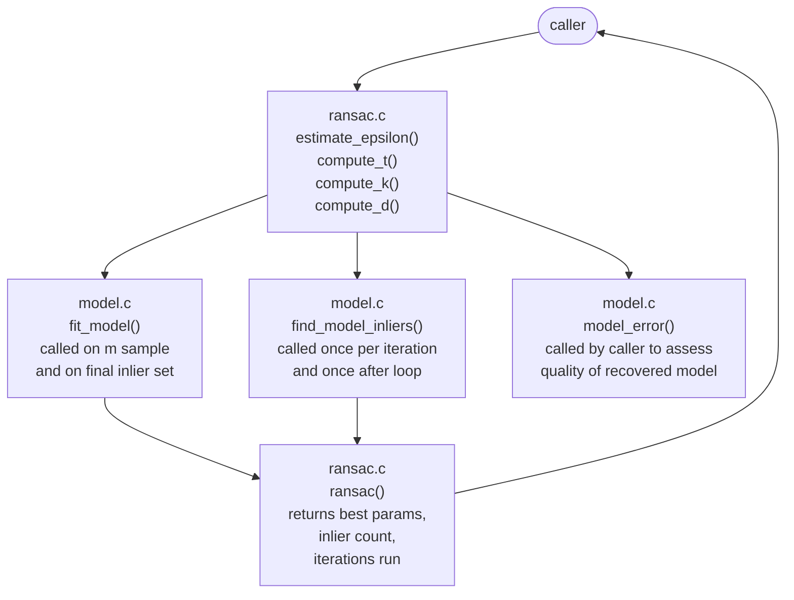
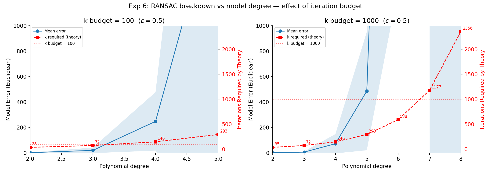

# Research Paper
* Name: Arsh Singh
* Semester: Spr 2026
* Topic: Random Sample Consensus (RANSAC) Algorithm

## Table of Content


- [Research Paper](#research-paper)
  - [Table of Content](#table-of-content)
  - [Introduction](#introduction)
    - [Motivating Problem: Stitching Two Overlapping Graphs](#motivating-problem-stitching-two-overlapping-graphs)
      - [Assumptions](#assumptions)
    - [Linear Regression Approach](#linear-regression-approach)
    - [RANSAC Approach](#ransac-approach)
    - [History of RANSAC](#history-of-ransac)
  - [Analysis of Algorithm](#analysis-of-algorithm)
    - [Algorithm](#algorithm)
    - [Flow Chart for RANSAC Algorithm](#flow-chart-for-ransac-algorithm)
    - [Proof of Correctness](#proof-of-correctness)
    - [Time Complexity Analysis](#time-complexity-analysis)
      - [Best, Worst, and Average Cases](#best-worst-and-average-cases)
    - [Space Complexity](#space-complexity)
      - [Best, Worst, and Average Cases](#best-worst-and-average-cases-1)
  - [RANSAC Parameters](#ransac-parameters)
    - [Threshold distance $t$](#threshold-distance-t)
    - [Iteration count $k$](#iteration-count-k)
    - [Table: $k$ for various $\\varepsilon$ for $p = 0.01$ and for line fitting where $m = 2$.](#table-k-for-various-varepsilon-for-p--001-and-for-line-fitting-where-m--2)
    - [Expected inlier count d](#expected-inlier-count-d)
    - [Estimating the Outlier Fraction $\\varepsilon$](#estimating-the-outlier-fraction-varepsilon)
  - [Empirical Analysis](#empirical-analysis)
    - [Experimental Setup](#experimental-setup)
      - [Synthetic Data Generation](#synthetic-data-generation)
      - [Measuring Recovery Quality](#measuring-recovery-quality)
      - [Experiment Parameters](#experiment-parameters)
      - [A Note on Numerical Precision](#a-note-on-numerical-precision)
    - [Experiment 1: Time Vs RANSAC Resampling Iterations $k$](#experiment-1-time-vs-ransac-resampling-iterations-k)
    - [Experiment 2: Time Vs Fraction of Outliers ($\\varepsilon$)](#experiment-2-time-vs-fraction-of-outliers-varepsilon)
    - [Experiment 3: Time Vs Threshold ($t$)](#experiment-3-time-vs-threshold-t)
    - [Experiment 4: How Does RANSAC Break Down as Outlier Fraction Increases?](#experiment-4-how-does-ransac-break-down-as-outlier-fraction-increases)
    - [Experiment 5: Structural Bias and RANSAC Failure](#experiment-5-structural-bias-and-ransac-failure)
  - [Application](#application)
  - [Implementation](#implementation)
    - [Language, Libraries, and Design Philosophy](#language-libraries-and-design-philosophy)
    - [Module Structure](#module-structure)
    - [Data Representation](#data-representation)
    - [Noise and Outlier Generation](#noise-and-outlier-generation)
    - [Parameter Estimation Helper Functions](#parameter-estimation-helper-functions)
    - [Polynomial Least Squares via the Normal Equations](#polynomial-least-squares-via-the-normal-equations)
    - [Vertical Residual as the Distance From Model](#vertical-residual-as-the-distance-from-model)
    - [The RANSAC Loop and the Final Refit](#the-ransac-loop-and-the-final-refit)
    - [Stochastic Behavior and Test Design](#stochastic-behavior-and-test-design)
  - [Summary](#summary)
    - [Summary of Findings](#summary-of-findings)
    - [Learning/Future Work](#learningfuture-work)
      - [Model Errors Are Very High for $m$ \> 3 At All $k$](#model-errors-are-very-high-for-m--3-at-all-k)
  - [Disclosures](#disclosures)
  - [References](#references)


## Introduction
<!-- 
- What is the algorithm/datastructure?
- What is the problem it solves?
- Provide a brief history of the algorithm/datastructure. (make sure to cite sources)
- Provide an introduction to the rest of the paper. 
-->

The Algorithm that I want to focus on is called Random Sample Consesus (RANSAC). The method was introduced by Martin Fischler and Robert Bolles in 1981 [1]. It is a method for fitting a predetermined model to experimental data with sizeable number of outliers or noise.

<!-- Motivate the discussion with an example create a noisy line genarator over three different graphs with different but over lapping ranges of x -->
To motivate a good idea of the problem this algorithm solves, its usefulness and effectiveness, I will use a toy example to show how one of most popular fitting models - the least squares model is not robust to outliers. I do not want to make the task unapproachable by starting off with homography on two images with overlap. But I do not want to do what standard texts to either: I am not estimating best fit functions for a given two-dimensional dataset.

I am doing something novel in this report, something inbetween: I abstract away from image pixels by using cartesian data, but the motivating problem is to stich together two overlapping noisy graphs made with same underlying generator model that can be easily estimated. 


### Motivating Problem: Stitching Two Overlapping Graphs
We are assigned the task of stitching together the two following graphs with overlapping x-range.

<!-- graph 1 -->

<!-- graph 2 -->

<!-- Some description of the graph data -->

#### Assumptions
It is known that the two graphs are built from the same linear model, but over different ranges of $x$. 

It is also known that the data is noisy with three possible kinds of errors as follow. 
   * Random gaussian noise (mean zero) 
   * Heavy-tailed laplace noise (also mean zero)
   * Classification errors or outliers that are not mean zero. 

It is also known that there is no appreciable continuous range of $x$ with systematic bias. Systematic bias is when the error is not random, but is correlated with $x$.

I will show how the problem solving will look like for linear regression and then I will show what the RANSAC solution looks like.


### Linear Regression Approach

<!-- 
* describe it
* how/why it is not robust
-->

### RANSAC Approach
Least squares produces a solution in a single pass using all points and always terminates in one pass regardless of outlier fraction - but is effected disproportionately by outliers. It gives outliers disproportionate influence through the squaring of large residuals. Thus least sqaures may return completely inaccurate models.

RANSAC is robust, that is it can deal with large proportions of outliers, random large errors that are not mean zero, that Fisher and Bolles call classification errors [2, 3, 4]. It is also known that it *cannot* deal with pervasive systematic bias.

As Fisher and Bolles state (rephrased) RANSAC inverts the logic of least squares: instead of fitting all the data first and cleaning up afterward, it starts with the smallest possible sample, finds a model, then recruits only the points that agree with it - these are called the model support. It does this repeatedly - many candidate models are estimated. The model with the largest support is deemed the best fit. 

In this way, RANSAC trades computational cost for robustness. RANSAC avoids giving overt weightage to large outliers by working with small random samples and only committing to points that agree with the candidate model. The cost is that many candidate models are tested before finding one with sufficient consensus or support, but this makes RANSAC robust to large proportions of outliers.


### History of RANSAC
<!-- [Show example of location determination - the one in the paper.] -->

The original paper demonstrated the application of RANSAC in *location determination problem* in computer vision. Today, RANSAC (Random Sample Consensus) is one of the most widely used tools for outlier rejection and data fitting, particularly in 2-D image stitching and structure from motion. The method has now been applied to a wide array of other problems [2, 3, 4]. I will disuss these in the section [Applications](#application). 


The rest of the paper is organized as follows: 

In the next section, [Analysis of Algorithm](#analysis-of-algorithm), I will present the theoretical analysis of the RANSAC algorithm tryting to fit a linear and a quadratic model. [Maybe: I will also generalize this to a k-neighbors classification problem.] I will present the time and space complexity in the case of the specified models. 

In the section [Empirical Analysis](#empirical-analysis), I will present the empirical run time of the methods I implement in Python [Maybe: and C]. I will do a comparative analysis based on the models and the three variables for RANSAC. 

In the section [Application](#application) I will take a deeper dive into the various applications of RANSAC. 

In the section [Implementation](#implementation) I will present code snippets of my final implementation [maybe C, else Python]. I willdo a walk through and present a commentary on my design choices.

In conlusion, I will present a [Summary](#summary) of my findings and lessons I learnt.


## Analysis of Algorithm
<!-- 
Make sure to include the following:
 - Time Complexity
 - Space Complexity
 - General analysis of the algorithm/datastructure
 - [Linear model]
 - [Quadratic model]
 - [Classification in n groups]
-->


<!-- Formal Definition -->

### Algorithm
The RANSAC paradigm is more formally stated [1] as follows.

Given a model that requires a minimum of $m$ data points to instantiate its free parameters, and two arrays $points\_x$ and $points\_y$ of $N$ data points such that $N \ge m$, RANSAC proceeds as follows:

1. Randomly select a subset $S_1$ of $m$ data points from $points\_x$ and $points\_y$ and instantiate the model. Use the instantiated model $M_1$ to determine the subset $S_1^*$ of points in $points\_x$ and $points\_y$ whose perpendicular distance from $M_1$ is within the threshold $t$. The array $S_1^*$ is called the consensus array of $S_1$.

2. If $|S_1^*| \ge expected\_inliers$, where $d$ is a threshold derived from the estimated outlier fraction $\varepsilon$, use $S_1^*$ to compute a refined model $M_1^*$ using least squares over all consensus points. Return $M_1^*$ as the best model.

3. If $|S_1^*| < expected\_inliers$, randomly select a new subset $S_2$ and repeat the above process, tracking the consensus array with the largest size seen so far.

4. If, after $k$ trials, no consensus array of size $d$ or greater has been found, refit the model using the largest consensus array found across all trials. If no consensus array was found at all, terminate in failure.

### Flow Chart for RANSAC Algorithm


### Proof of Correctness

RANSAC does not guarantee that the correct model is always found — it is a randomized algorithm and makes no deterministic guarantees. Instead it provides a probabilistic guarantee: given enough iterations, the correct model is found with high probability. The proof is embedded in the derivation of the iteration count $k$.

**Claim:** After $k$ iterations, RANSAC finds at least one clean sample — a sample drawn entirely from inliers — with probability at least $1 - p$, where $p$ is an acceptable failure probability.

**Proof:** Let $\varepsilon$ be the outlier fraction and $m$ be the minimum sample size required to instantiate the model. The probability that a single randomly drawn point is an inlier is $(1 - \epsilon)$. Since points are drawn independently, the probability that all $m$ points in a sample are inliers is:

$$(1 - \epsilon)^{m}$$

The probability that a single sample contains at least one outlier — that is, the sample is not clean — is:

$$1 - (1 - \epsilon)^{m}$$

The probability that all $k$ independent samples fail to be clean is:

$$\left[1 - (1 - \epsilon)^{m}\right]^{k}$$

Setting this equal to the acceptable failure probability $p$ and solving for $k$:

$$\left[1 - (1 - \epsilon)^{m}\right]^{k} = p$$

Taking log transformation on both sides and rearranging to isloate $k$.

$$k = \frac{\log(p)}{\log\left(1 - (1 - \epsilon)^{m}\right)}$$

This is the formula implemented in `compute_k`. It gives the minimum number of iterations required to guarantee that at least one clean sample is drawn with probability $1 - p$.

Fischler and Bolles recommend $p = 0.01$, giving 99 percent confidence. 

The formula makes three assumptions. First, the underlying model matches the model we are assuming. i.e the true model shouldn't be cubic $m$ needed = 4, while we are trying to fit a linear model with $m = 2$. In this case we may never reach a model with good enough accuracy. Second, the outliers are distributed randomly rather than clustered, and Third, that the inlier fraction $(1 - \epsilon)$ is known or can be estimated with fair accuracy. If either second or third assumption is violated, the actual number of iterations needed to rech the true model may exceed $k$.

### Time Complexity Analysis

Looking at the flow chart. For each of the $k$ iterations:

| Step | Description | Time Complexity of Step |
|:-|:-|:-|
| 1 | sample $m$ points | $O(m)$ |
| 2 | fit line to sample | $O(m)$ |
| 3 | compute distances of each point to the model | $O(N)$ |
| 4 | count inliers | $O(N)$ |

The steps 3 and 4 are have dominant time complexity of $O(N)$.

So the overall time complexity = $O(k \cdot N)$

$k$ itself depends only on $\varepsilon$ and $m$ (minimum parameters to be estimated), not on $N$. So the time complexity of the analysis is linear in $N$. 

#### Best, Worst, and Average Cases
The best case occurs when the early stopping condition is triggered on the first iteration — a clean sample is drawn immediately and the consensus set meets $d$. In this case only one pass over the data is needed, giving $O(N)$. 

The worst case occurs when no early stop is triggered and all $k$ iterations run to exhaustion, giving $O(k \times N)$. 

The average case lies between these extremes and is governed directly by the $k$ formula — at low outlier fractions a clean sample is found quickly and the average cost approaches $O(N)$, while at high outlier fractions many iterations are needed and the average cost approaches the worst case.

### Space Complexity

I only implement arrays. The rate limiting size is `N`. So the space complexity of RANSAC is $O(N)$.

| Data Structure | Space Complexity |
|:-|:-|
|`distances` | $O(N)$ |
|`points_x` | $O(N)$  worst case all points are inliers |
|`points_y` | $O(N)$ worst case all points are inliers |
|`idx` | $O(N)$ Fisher-Yates index array |
|`sample_x` | $O(m)$  constant |
|`sample_y` | $O(m)$  constant |


#### Best, Worst, and Average Cases
Space complexity is $O(N)$ in all cases. The algorithm allocates a distances array of size $N$ per iteration, and a separate inlier array of at most $N$ elements for the final refit. No additional memory scales with $k$ — running more iterations does not increase memory usage, only runtime.


## RANSAC Parameters

RANSAC is governed by three parameters that jointly determine both the quality of the estimated model and the computational cost of finding it. These are: 
* the threshold distance $t$, 
  * $t$ in the original paper;
* the number of iterations $k$, 
  * $k$ in the original paper; and 
* the expected inlier count $d$, 
  * $t$ in the original paper.


### Threshold distance $t$

The threshold $t$ defines the boundary between inliers and outliers. A point is classified as an inlier if its perpendicular distance from the candidate model falls below $t$. Setting $t$ too small causes RANSAC to reject points that are legitimate inliers corrupted by small measurement noise, starving the consensus set. Setting $t$ too large causes it to accept outliers as inliers, corrupting the consensus set from the other direction. In practice, $t$ is derived from the data itself rather than set in advance. Fischler and Bolles suggest setting $t$ at one or two standard deviations beyond the measured average residual error, that is 

$$threshold = \bar{e} + 2\sigma.$$

Where,
* $\bar{e}$ is the mean residual error and 
* $\sigma$ is its standard deviation computed over the full point set.


### Iteration count $k$

The iteration count $k$ controls how many independent random samples are drawn. Each sample of $N$ points defines a candidate model, and $k$ determines how thoroughly the space of candidate models is explored. It is often computationally infeasible and unnecessary to try every possible sample. Instead the number of samples is chosen sufficiently high to ensure with a probability, $p$, that at least one of the $k$ samples is drawn entirely from inliers — and therefore yields a good model. $p$ is set externally based on which $k$ can be derived analytically. 

If $\varepsilon$ is the outlier fraction and $m$ is the minimum sample size, then the probability of drawing a clean sample in a single trial is $(1 - \varepsilon)^{m}$. The probability that all $k$ trials fail is therefore $[1 - (1-\varepsilon)^{m}]^{k}$. Solving for $k$ gives:

$$k = \frac{\log(p)}{\log(1 - (1 - \varepsilon)^{m})}$$

This formula shows how $k$ depends on the outlier fraction and the model complexity. The probability of failure $p$ in this function is provided externally. Fischler and Bolles suggest a failure probability of $p = 0.01$, meaning RANSAC is given a 99 percent chance of finding at least one clean sample across all $k$ iterations. This is the standard practical choice in the literature. 

As the outlier fraction ($\varepsilon$) grows $k$ grows rapidly to maintain the same confidence level as shown in the table below for $p = 0.01$ and for line fitting where $m = 2$. 

### Table: $k$ for various $\varepsilon$ for $p = 0.01$ and for line fitting where $m = 2$.
| Outlier fraction $\varepsilon$ | Required iterations $k$ for 99% confidence |
|---|---|
| 0.10 | 2 |
| 0.30 | 7 |
| 0.50 | 17 |
| 0.70 | 49 |
| 0.90 | 459 |

This exponential growth motivates the early stop parameter $d$ — at high outlier fractions, running all $k$ iterations is computationally expensive, and terminating early when a sufficiently good model is found provides significant practical savings.


### Expected inlier count d

The expected inlier count $d$ serves as an early stopping criterion. Once a candidate model achieves a consensus set of size at least $d$, the search terminates without exhausting all $k$ iterations. At an outlier fraction of 0.90 the required iteration count reaches 459, making early stopping practically important. 

The parameters $k$ and $d$ have opposing roles: $k$ is a safety net that pushes the iteration count up to guarantee confidence, while $d$ is an exit condition that pulls it down as soon as a good enough model is found. Setting $d$ too conservatively — close to $N$ — causes RANSAC to always run all $k$ iterations. Setting it too aggressively — close to $m$ — risks accepting a suboptimal model. 

Because both depend on the same assumption about the data, they should be set consistently using the same outlier fraction $\epsilon$:

$$expected\_inliers = \lfloor (1 - epsilon) \times N \rfloor$$

Estimating $\varepsilon$ is discussed in the following section.


### Estimating the Outlier Fraction $\varepsilon$

Choosing a good value for $\varepsilon$ is more subtle than it appears because the problem is circular: $\varepsilon$ is needed to set $k$ and $d$, but the true outlier fraction is only known after the inliers have been identified. Three data-driven approaches are common in practice [2, 4]. 

The first approach uses the residual distribution: fit a rough model to all the data using least squares, compute the residuals, and treat points with residuals beyond $\bar{e} + 2\sigma$ as likely outliers. The fraction of such points estimates $\varepsilon$. 

The second approach plots a histogram of residuals from the least squares fit. A dataset with outliers typically shows a bimodal distribution — a tight cluster of inlier residuals near zero and a diffuse spread of outlier residuals further out. The fraction in the diffuse spread gives $\varepsilon$. 

The third approach uses iterative refinement: start with a conservative overestimate such as $\epsilon = 0.5$, run RANSAC, observe the inlier fraction of the best model, update $\varepsilon$, and rerun until convergence. 

I implement the first approach as `estimate_epsilon` and its limitations are documented. But since true $\varepsilon$ is known from synthetic generation it is used directly in experiments.

## Empirical Analysis
<!-- 
- What is the empirical analysis?
- Provide specific examples / data.

HIGHLIGHTS:
1. Abstracting away from image complexities by using 2-D points instead of pixels. 
2. Keeping cartesian points also allows me to represent my analysis using simple and easy to interpret graphs.

EXPERIMENTS:
Linear:     breakdown vs outlier fraction + structural bias pr
Quadratic:  same, compare against linear
Complexity: at what m does RANSAC fail for reasonable but fixed k, threshold, N?
-->
I have organize the empirical analysis around five questions, each probing a different aspect of RANSAC algorithm.  These are direct tests of the the theoretical parameter analysis of Section 2 to observed behavior using synthetic data. 

The first three explore how the run-time varies with one of the parameters keeping the other two fixed. The fourt and fifth model fix the model degree and vary the data conditions. Together fourth and fifth test the boundaries of what RANSAC can and cannot recover.

### Experimental Setup

#### Synthetic Data Generation

In these experiments I abstract away from images and use catesian graph points instead. All experiments use points generated from known polynomial models which I call generators or generator models. This allows the true parameters to be compared directly against RANSAC's recovered parameters. This gives an exact measure of model error that would be impossible with real image data. Each dataset is constructed in four stages: inlier generation, noise injection, outlier placement, and optional structural bias. Each stage is implemented as a separate function, allowing any combination to be composed independently and tested in isolation.

**Inlier generation.** A set of $N_{\text{inlier}}$ points is placed exactly on the true polynomial model $y = a_0 + a_1 x + \cdots + a_{m-1} x^{m-1}$, with $x$ values spaced evenly across a fixed range $[x_{\min}, x_{\max}]$. The true parameters are fixed at $a_0 = 5$, $a_1 = 2$ for linear experiments, and $a_0 = 1$, $a_1 = 1$, $a_2 = 1$ for quadratic experiments.

**Gaussian noise.** Zero-mean Gaussian noise with standard deviation $\sigma$ is added to the $y$ values of all inlier points. This models sensor measurement error — the dominant noise type in most physical measurement systems. Gaussian noise is generated using the Box-Muller transform [5], which produces exactly Gaussian samples from two uniform random draws without rejection sampling:

$$z = \sqrt{-2 \ln u_1} \cos(2\pi u_2), \qquad u_1, u_2 \sim \text{Uniform}(0, 1)$$

The noise standard deviation $\sigma$ is set to $0.5$ in all experiments unless stated otherwise, giving a signal-to-noise ratio that is realistic but tractable.

**Outliers.** Classification errors — points that lie far outside the inlier band — are appended to the dataset after noise injection. Outliers are placed in an $x$ range that extends two data ranges beyond the inlier $x$ extent, and at $y$ values guaranteed to lie outside the inlier band $|y - \hat{y}| > 2\sigma$. This construction guarantees that every appended point is a true classification error and not an accidental inlier, giving exact control over the outlier fraction $\varepsilon = N_{\text{outlier}} / (N_{\text{inlier}} + N_{\text{outlier}})$.

**Structural bias.** Structural bias is a systematic deviation applied to a random fraction $p_r$ of inlier points using a deterministic function $b(x)$. Unlike Gaussian noise, which is independent at each point and averages to zero over the dataset, structural bias introduces a coherent shift that RANSAC cannot distinguish from a different true model if $p_r$ is large enough. Three bias functions are used: constant bias $b(x) = c$, linear bias $b(x) = \alpha x$, and periodic bias $b(x) = \sin(x)$. Periodic bias is expected to be more benign than constant or linear bias because it averages to near zero over a full period, reducing its net effect on the consensus set.

#### Measuring Recovery Quality

Model recovery quality is measured as the Euclidean distance between the estimated parameter vector $\hat{\mathbf{a}}$ and the true parameter vector $\mathbf{a}^*$:

$$\text{error} = \|\hat{\mathbf{a}} - \mathbf{a}^*\|_2 = \sqrt{\sum_{j=0}^{m-1} (\hat{a}_j - a_j^*)^2}$$

This is a single scalar that captures error across all model parameters simultaneously, regardless of polynomial degree. Because RANSAC is stochastic, each experiment is repeated $R = 20$ times with different random seeds and the mean error and standard deviation are reported.

#### Experiment Parameters

The three experiments share a common parameter baseline.

For all experiments, $N = 1000$ points are used, split between inliers and outliers according to the outlier fraction $\varepsilon$. This choice is larger than the $N = 100$ commonly used in illustrative examples, and is motivated by two practical considerations. First, timing resolution: the C implementation runs fast enough that at $N = 100$ individual function calls complete in nanoseconds, making wall-clock timing unreliable. At $N = 1000$ the dominant operations — normal equation accumulation in `fit_model` and residual computation in `find_model_inliers` — run long enough to be measured reliably in microseconds using `clock()`. Second, statistical stability: at $\varepsilon = 0.1$ and $N = 100$ only 10 outlier points are added, which is too few to represent a stable outlier distribution. At $N = 1000$ the same fraction produces 100 outliers, giving a more representative and repeatable experiment across the `N_REPEATS = 100` independent runs.

The inlier threshold $t$ is estimated from the noisy inlier data before outliers are added, using $t = \bar{e} + 2\sigma$ applied to the vertical residuals of a preliminary least squares fit. The expected inlier count $d$ is computed from the true $\varepsilon$ as $d = \lfloor (1 - \varepsilon) \cdot N \rfloor$. The iteration count $k$ is computed from the true $\varepsilon$ and the model degree using the analytical formula with failure probability $p_{\text{fail}} = 0.01$.

#### A Note on Numerical Precision

All computations use single-precision floating point (`float`), which stores numbers with about seven significant digits. This matches the C implementation and is the natural choice for a system designed with embedded targets in mind, where memory is limited and `double` precision doubles the cost per value.

The limitation of single precision becomes visible when fitting high-degree polynomials. The least squares solver builds a matrix $X^\top X$ whose entries are sums of powers of $x_i$. As the polynomial degree grows, those powers grow rapidly — for degree 6 over $x \in [0, 9]$, the largest entry reaches roughly $10^{15}$, far beyond what seven digits of precision can represent accurately. When Gaussian elimination then tries to solve a system built from such large numbers, small rounding errors get amplified into large errors in the recovered coefficients. The result is a model that looks numerically valid but is wildly wrong — not because RANSAC failed, but because the underlying solver lost precision.

This is a known issue with the Vandermonde design matrix, it becomes harder and harder to solve accurately as the polynomial degree increases. In practice it is fixed by scaling $x$ to a small range such as $[0, 1]$, or by switching to `double` precision, which provides fifteen significant digits and pushes the stable range to roughly degree 14. For this project, $x$ is scaled to $[0, 1]$ and I use `double` precision for gaussian elimination in the function `fit_model` in `model.c`. Yet, a small number of runs across all experiments produce unrealistically large model errors due to this effect and are precision concerns rather than RANSAC failures. I ignore these by plotting mean and the confidence interval is 10th percentile to 90th percentile of the value.

Experiment 01, 02, and 03, confirm the theoretical relationship of parameters with time complexity using run times and efficacy using model error.

### Experiment 1: Time Vs RANSAC Resampling Iterations $k$


The graph plots the data from Experiment 1: wall-clock time (μs) against the number of RANSAC iterations $k$, varied from 10 to 500 in steps of 10, with $\varepsilon = 0.5$ fixed throughout. Two models are shown — linear ($m=2$) in blue and quadratic ($m=3$) in red — each as a solid line with markers showing the median time across repeats and a shaded band covering the 10th to 90th percentile. A secondary y-axis on the right shows mean model error for each model as a dashed line, using the same colors. $N = 1000$ points are used throughout and the experiment repeats 100 times per condition.

The graph confirms that for higher degree model (higher $m$) the time taken is higher for all $k$.

The graph also confirms that wall-clock time grows linearly with the number of iterations `k`, as expected from the algorithm's structure — each iteration fits a model to a minimal random sample and counts inliers, both O(N) operations, so total cost is O(k·N). The two models track closely, with the quadratic (`m=3`) slightly slower than the linear (`m=2`) at every `k` value, reflecting the additional cost of fitting one extra parameter in the normal
equations. Model error remains flat across all `k` values for both models, confirming that beyond the theoretically required number of iterations, additional iterations do not improve accuracy — they only increase runtime. This linear relationship between `k` and time is the key computational cost of RANSAC and motivates the importance of choosing `k` carefully rather than running an arbitrarily large budget.

### Experiment 2: Time Vs Fraction of Outliers ($\varepsilon$)



The graph plots the data from Experiment 2. The graph of data from Experiment 2 confirms that as $m$ increases the time for all $\varepsilon$ increases.

This graph also confirms that time should reduce as $\varepsilon$ increases. A notable feature of the wall-clock time profile is that time peaks near ε = 0.5 and then decreases at higher outlier fractions. The flat part of the curve is due to the fact that at low $\varepsilon$ we expect large $d$ and the RANSAC usually does not terminate due to early stop, but due to exhaustion of $k$ which is set for $\varepsilon = 0.5$.

The decreases after $\varepsilon = 0.5$ is the expected behavior: it is due to RANSAC's early stopping condition: the algorithm terminates as soon as it finds a consensus set of size d, the minimum expected inlier count derived from epsilon. As epsilon increases, d shrinks — fewer points need to agree for RANSAC to declare success. At high outlier fractions, even a poor model can accumulate d inliers quickly by chance, causing early termination. Paradoxically, this means RANSAC runs fastest precisely when the data is most contaminated, though the returned model is correspondingly less reliable, as confirmed by the rising model error on the secondary axis.


### Experiment 3: Time Vs Threshold ($t$)



The graph plots the data from Experiment 3.

Experiment 03 confirms that as we increase threshold $t$: allow more observations to fall into inliers in every iteration of RANSAC, the time for the model to run decreases. But such models are also not accurate as is confirmed by the curve of error moving in the upward direction. 

The graph also confirms that these results are more pronounced for higher degree models ($m = 3$) than lower ($m = 2$).

Note that the initial increase of the time (while error falls) is due to the fact that we have kept noise at 2 * $noise\_std$ and add outliers to fall outside this band, thus for small $t$ up to 2, even true noisy inliers may fall outside the threshold. RANSAC struggles to find $d$ inliers and runs many iterations before succeeding or exhausting $k$. That's the slow region. Beyond multiplier 2, the threshold is so wide that outliers start falling into inliers too, inflating the consensus set size past $d$ quickly and triggers early stopping — hence the drop.


### Experiment 4: How Does RANSAC Break Down as Outlier Fraction Increases?

The number of iterations required to draw at least one clean sample with probability $p = 0.99$ is given analytically by $k = \log(1 - p) / \log(1 - (1 - \varepsilon)^{n})$, where $\varepsilon$ is the outlier fraction and $n$ is the minimum sample size. As $\varepsilon$ gets close to 1, $k$ grows without bound. The first experiment asks at what outlier fraction RANSAC fails in practice when $k$ is held fixed at a reasonable value. The size of the sample `N` is 1000 each of the experiment is repeated 100 times, each run is recorded.

The iteration count $k$ is fixed at the value computed for $\varepsilon = 0.5$, and $\varepsilon$ is varied from $0.1$ to $0.9$. The experiment is repeated across three values of $N$ to separate the effect of dataset size from the effect of outlier fraction.

For $\varepsilon = 0.5$, $p$ = 0.99, and $\log_2$:

For $n = 2$:

$$k = \frac{\log_2(0.01)}{\log_2(1 - (0.5)^2)} = \frac{-6.644}{\log_2(0.75)} = \frac{-6.644}{-0.415} \approx 17$$

For $n = 3$:

$$k = \frac{\log_2(0.01)}{\log_2(1 - (0.5)^3)} = \frac{-6.644}{\log_2(0.875)} = \frac{-6.644}{-0.193} \approx 35.$$

Thus, this experiment is first run the linear model ($n = 2$) keeping $k$ constant at 17, and then for the quadratic model ($n = 3$) keping $k$ constant at 35. 

The recovered model error — the Euclidean distance between the estimated and true parameter vectors — is recorded at each value of $\varepsilon$. 

On the graph, the x-axis shows $\varepsilon$ and the y-axis shows Euclidean model error. The shaded band covers the 10th to 90th percentile of error across repeats. The red dashed line marks the breakdown threshold — defined as the mean error at the lowest $\varepsilon$ plus two standard deviations (2 * the noise standard deviation) — and the green vertical line marks the first $\varepsilon$ where the mean crosses it. Below the threshold RANSAC reliably recovers the true model; above it the returned parameters can no longer be trusted. 

The two subplots share the same x-axis but have different y-limits, reflecting that $m=3$ accumulates larger errors before breakdown due to the higher minimum sample size required per iteration.

The expected result is a sharp increase in model error above a critical $\varepsilon$, with the linear model tolerating a higher outlier fraction than the quadratic model for the same $k$. This asymmetry is a direct consequence of the exponential term $(1 - \varepsilon)^n$ in the iteration formula: each additional parameter in the model amplifies the sensitivity to outliers.




### Experiment 5: Structural Bias and RANSAC Failure
Experiment 5 investigates at what structural bias probability RANSAC begins to fail. Unlike Experiment 4 which varied the outlier fraction, here the outlier fraction is fixed at $\varepsilon = 0.3$ and the probability $pr$ that any outlier carries a structural bias is varied from 0.05 to 1.0 in steps of 0.05.

Three bias types are tested — constant, linear, and periodic — each representing a different way that outliers might be systematically distributed rather than randomly scattered. Both the linear (`m=2`) and quadratic (`m=3`) models are evaluated. The iteration budget `k` is fixed at the value computed for $\varepsilon = 0.5$, matching the convention established in Experiment 4, so that results are directly comparable across experiments. The breakdown threshold is defined as the mean model error at $pr = 0$ plus two standard deviations — any error above this level is attributed to the structural bias rather than noise alone. The size of the sample `N` is 1000 each of the experiment is repeated 100 times, each run is recorded.

I plot model error against bias probability $pr$ for each combination of model degree and bias type, arranged as a 2×3 grid of subplots — rows correspond to $m=2$ (linear) and $m=3$ (quadratic), columns to the three bias types: constant, linear, and periodic. 

The x-axis runs from $pr=0$ (no bias) to $pr=1.0$ (all outliers are biased), and the y-axis
shows the Euclidean model error averaged across repeats. The shaded band shows the 10th to 90th percentile of model error across repeats, giving a sense of run-to-run variability. 

The red dashed horizontal line marks the breakdown threshold, defined as the mean error at $pr=0$ plus two standard deviations (only due to noise) — the point at which error can no longer be attributed to noise alone. A subplot where the mean error crosses this threshold indicates that the corresponding bias type has overwhelmed RANSAC's ability to distinguish inliers from biased outliers, and the returned model is no longer reliable.



## Application
<!-- 
- What is the algorithm/datastructure used for?
- Provide specific examples
- Why is it useful / used in that field area?
- Make sure to provide sources for your information.
-->

RANSAC (Random Sample Consensus) is one of the most widely used tools for outlier rejection and data fitting, particularly in image stitching and structure from motion. Allow me to motivate its need and define image stitching. 

Many real-world computer vision tasks require a field of view far wider than what a single camera can capture. Many smart-phone owners may be familiar with the features of camera such as panoramic imaged, and video stabilization. Image stitching is also needed in industrial applications such as satellite and aerial imaging, medical imaging, autonomous navigation, and augmented reality — anywhere a spatial context is needed that a single image cannot provide.

In image stitching, the goal is to align two or more overlapping images by estimating a geometric transformation — such as a homography — that maps points from one image to corresponding points in another. This requires finding reliable feature correspondences between images. However, automated feature matching is inherently noisy: many matched point pairs will be incorrect, either due to repetitive textures, illumination differences etc. These incorrect matches, or outliers, is exactly what are handled gracefully and efficiently by RANSAC.

<!--
When the number of measurements is quite large, it may be preferable to only score a subset
of the measurements in an initial round that selects the most plausible hypotheses for additional
scoring and selection. This modification of RANSAC, which can significantly speed up its per-
formance, is called Preemptive RANSAC (Nist´
er 2003). In another variant on RANSAC called
PROSAC (PROgressive SAmple Consensus), random samples are initially added from the most
“confident” matches, thereby speeding up the process of finding a (statistically) likely good set of
inliers (Chum and Matas 2005). Raguram, Chum et al. (2012) provide a unified framework from
which most of these techniques can be derived as well as a nice experimental comparison.
-->


## Implementation

<!-- 
- What language did you use?
- What libraries did you use?
- What were the challenges you faced?
- Provide key points of the algorithm/datastructure implementation, discuss the code.
- If you found code in another language, and then implemented in your own language that is fine - but make sure to document that.

HIGHLIGHTS:

1. Abstracting away from image complexities by using 2-D points instead of pixels. 
2. Keeping cartesian points also allows me to represent my analysis using simple and easy to interpret graphs.
3.  
-->

### Language, Libraries, and Design Philosophy

The implementation was developed in two stages. I am more familiar with Python and my code writing speed in Python is much father than in C. So first I developed a  Python prototype to validate correctness of my thoughts and ideas taken from the original paper and other texts which do not procide any pseudocodes. I explored design decisions and testing in Python as well with one big limitation. In this phase I limiting myself to the simple linear model case. This approach allowed me to very quickly get familiar with RANSAC and the challenges in its implementation, and when writing in C I was able to do it much faster based on the previous python codes that I had very carefully kept C-adjacent as I explain further below. 

In the second phase I translated the tests and functions to C test-by-test and function-by-function under a test-driven discipline, but improving the design to accommodate flexible models at the same time. 

I do not present code snippets to the Python prototype, but the entire set of codes is in the folder [other/python_linear](other/python_linear). These are not true Python codes since I used only the standard library — `math`, `random`, and `unittest` — with no NumPy, SciPy, or other numerical libraries. This constraint was deliberate: every operation that could not be expressed in standard C was avoided from the start, making the translation straightforward and mechanical. The C implementation likewise uses only `math.h`, `stdlib.h`, `stdio.h`, and `time.h`.

While I am working on RANSAC that is a key algorithm used in computer vision, a key design choice was to abstract away from image pixels entirely and work with two-dimensional Cartesian point sets instead. This eliminates image I/O, coordinate transformations, and feature detection complexity, allowing the focus to remain on the algorithm itself. It also has an analytic benefit: Cartesian points can be generated with exact ground truth — known slope, intercept, noise distribution, and outlier fraction — making it possible to measure model recovery error precisely and plot results as clean, interpretable graphs. This would not be possible if the data came from real images, where ground truth is unknown.

### Module Structure

The implementation is organized across four modules, shown in the flowchart below.



`generator.c` produces synthetic data; `model.c` provides fitting, inlier collection, and error measurement; and `ransac.c` implements the algorithm and its parameter helpers. The caller interacts only with `ransac.c` and `model.c` through their public headers.

### Data Representation

Points are stored as separate flat arrays `points_x` and `points_y` rather than as an array of `(x, y)` tuples. This was a deliberate choice for two reasons. First, separate arrays are mutable in place in C without pointer arithmetic on struct members, making in-place noise injection and outlier appending straightforward. Second, this layout maps directly to the Vandermonde accumulation in `fit_model`, where `points_x[i]` and `points_y[i]` are accessed independently in tight loops.

Model parameters are stored as a flat array of $m$ coefficients from lowest to highest degree: `params[0]` $= a_0$, `params[1]` $= a_1$, and so on. The `return_array` of `ransac()` is similarly a flat array with a documented layout:

```
return_array[0]               number of inliers in best model
return_array[1]               number of iterations actually run
return_array[2..2+m-1]        best model params (a0, a1, ...)
```

A natural next step would be to replace `return_array` with a `RansacResult` struct, making the fields named rather than positional.

### Noise and Outlier Generation

Noise is injected as separate functions — `add_gaussian_noise`, `add_outlier`, and `add_structural_bias` — rather than as a single combined generator. This separation serves the empirical analysis directly: by swapping noise functions, the effect of each noise type on RANSAC recovery can be measured in isolation.

 Gaussian noise models sensor measurement error. 
 
 ```c

 ```
 
 Outliers are what Fischler and Bolles call classification errors, these are strictly outside the 2 * $\sigma$ band around the model. 
 
 ```c

 ```

 Structural bias models systematic error such as lens distortion that affects a fraction $p_r$ of points coherently rather than randomly. The `add_structural_bias` function accepts a function pointer `float (*bias_fn)(float)`, allowing any bias shape — constant, linear, or periodic — to be injected without modifying the generator.

```c

```

### Parameter Estimation Helper Functions

Rather than requiring the caller to supply $\varepsilon$, $k$, $d$, and $t$ directly, four helpers derive these values from the data.

`estimate_epsilon` fits a least squares line to all points, computes vertical residuals, and returns the fraction exceeding $\bar{e} + 2\sigma$ as an estimate of $\varepsilon$. 
 
`compute_t` uses the same distribution to set $t = \bar{e} + 2\sigma$, consistent with Fischler and Bolles [1]. 

`compute_k` applies the analytical formula:
$k = \left\lceil \frac{\log(p_{\text{fail}})}{\log\left(1 - (1-\varepsilon)^m\right)} \right\rceil$.

`compute_d` computes $d = \lfloor (1 - \varepsilon) \cdot N \rfloor$. 

Both `estimate_epsilon` and `compute_t` are unreliable at high outlier fractions because the preliminary fit is corrupted by the outliers it is trying to characterize — the same problem RANSAC was designed to solve. 

In this project $\varepsilon$ is known exactly from the synthetic data generation process, so the helpers serve as a demonstration of the estimation procedure for real-world settings where the true $\varepsilon$ is unknown. This design also makes the relationship between $\varepsilon$, $k$, $d$, and $t$ explicit and independently testable.


### Polynomial Least Squares via the Normal Equations

Given $N$ points $(x_i, y_i)$, a polynomial model of degree $m - 1$ requiring $m$ coefficients is fit by minimizing the sum of squared vertical residuals:

$$\min_{\mathbf{a}} \sum_{i=1}^{N} \left( y_i - \sum_{j=0}^{m-1} a_j x_i^j \right)^2$$

Arranging the data into a Vandermonde design matrix $X \in \mathbb{R}^{N \times m}$, where $X_{ij} = x_i^j$, and a response vector $\mathbf{y} \in \mathbb{R}^N$, the solution satisfies the normal equations $X^\top X \, \mathbf{a} = X^\top \mathbf{y}$. The entries are accumulated as:

$$(X^\top X)_{rc} = \sum_{i=1}^{N} x_i^{r+c}, \qquad (X^\top \mathbf{y})_r = \sum_{i=1}^{N} x_i^r \, y_i$$

I precomputed powers of $x_i$ are precomputed up to degree $2(m-1)$ and reused these to avoid redundant `pow` calls. 

I solve normal equations are solved via Gaussian elimination with partial pivoting and back substitution [7, 8]. A zero pivot indicates a singular matrix and the function returns an error. The coefficient vector is recovered by back substitution. For $m = 2$ this reduces to ordinary least squares line fitting, but the implementation handles all degrees without making any special case for the linear model.

```C

```
### Vertical Residual as the Distance From Model

The distance from a point $(x_i, y_i)$ to the polynomial model is measured as the vertical residual:

$$\text{distance}_i = \left| \sum_{j=0}^{m-1} a_j x_i^j - y_i \right|$$

This is the absolute difference between the predicted and observed $y$ value. In the linear model with Python I had used perpendicular distance, but the vertical residual is preferred here because it extends naturally to polynomial models of any degree, for which perpendicular distance has no simple closed form. The absolute value ensures the distance is non-negative regardless of which side of the model the point lies on. A separate function `points_to_line_distances` computes the true perpendicular distance for linear models only, and is retained for completeness and comparison.

### The RANSAC Loop and the Final Refit

The core loop samples $m$ random indices using a partial Fisher-Yates shuffle — only the first $m$ positions are shuffled at $O(m)$ cost rather than $O(N)$ — fits a candidate model to the sample, counts inliers based on vertical distance from the model, and tracks the best model as the one with the highest number of inliers. An early stop exits the loop as soon as `expected_inliers` are reached. A better one may be found later on, but RANSAC's philosphy is after all to find a good-enough model and save time and computation cost.

A critical implementation detail follows Fischler and Bolles directly [1]: the final refit on all inliers of the best consensus set is a post-processing step, not part of the RANSAC iteration. Inside the loop, the model is fit only to the $m$-point sample. After the loop, all inliers of the best model are collected and the model is refit on the full consensus set. This two-stage design is what gives RANSAC its accuracy: the loop finds the consensus, and the refit uses that consensus to produce a statistically efficient estimate.

```c
/* INSERT: ransac() main loop */

/* INSERT: _final_refit call */
```

### Stochastic Behavior and Test Design

[proof_of_tests_all.txt](proof_of_tests/proof_of_tests_all.txt) 

Because RANSAC is a randomized algorithm, its tests are inherently probabilistic. With a failure probability of $p = 0.01$, approximately one test run in one hundred will fail even on a correct implementation. This is not a bug — it is the designed behavior of the algorithm, and it means that a single test failure is not evidence of a defect. The test suite is designed to reflect this: tolerance deltas are set wide enough to accommodate the noise level of the synthetic data.

Although the [tests I report](proof_of_tests/proof_of_tests_all.txt) pass, there were a few tests that fail randomly and pass on another the next run. The empirical analysis repeats each experiment multiple times to report average behavior rather than a single run. 

The theoretical guarantee is that with $k$ iterations computed from the $k$ formula, RANSAC finds a correct model with probability at least $1 - p$. The tests verify this at the chosen $p = 0.01$ level.


## Summary
<!-- 
- Provide a summary of your findings
- What did you learn?
-->
### Summary of Findings

In the paper I show that the relationship between run time of RANSAC is directly proportional to $k$, the number of iterations or resamples; and inversly proportional to $\varepsilon$ or $d$ and $t$ - threshold of tolerance for error in consesus set as expected - allowing for noise in the data.

I also explore the limits of accuracy of RANSAC using two experiments when the data has significant amount of outliers and different kinds of biases. Since I know the noise threshold and the true parameters of the data, I am able to show at what point the models are not evaluated correctly. For higher degree models and more complex biases recovery of true models becomes more difficult in the presense of higher proportions of outliers and bias.

At a higher level, I also learnt and demonstrate the importance of using synthetic data for exploring RANSAC that abstracts away from real images - it allowed me to understand exactly why some of the eccentricities of the graphs from the empirical data.

Also at higher level, I am reminded of the importance of knowing fundamental mathematics like higher level linear algebra for computer science. For models of third-degree ($m$ = 4) and higher, the rate-limiting step is solving the model. I used gaussian elimination which is fair choice for a beginnner, easy to understand and implement, but ultimately a poor choice as I explain further in the subsection below. Literature suggests there are other algorithms that will be much more robust to higher degree models for exaple QR decomposition. For this reason, experiments involving model complexity are restricted to degrees 2 and 3 and an experiment I performed is not presented in the main report.


### Learning/Future Work

A key limitation of this implementation is how the polynomial fitting step solves for model parameters. The code builds a matrix from powers of x and solves the resulting system using Gaussian elimination on the normal equations. For low-degree polynomials this works well, but as the degree increases the matrix becomes increasingly difficult to solve accurately — a property called ill-conditioning. Switching the internal arithmetic from float to double improved results at degree 3, but degree 4 and above still produced unreliable fits. A more robust approach would use QR decomposition or Support Vector Decomposition (SVD) [10]. These approaches do not form the problematic normal matrix.

I report codes for an experiment asking at what degree RANSAC fails when $k$ is at a fixed budget of $k = 100$ and $k = 1000$ and the outlier fraction is held at moderate $\varepsilon = 0.5$.  Based on the theoretical $k$ required, I expected to see that for $k = 100$ models up to degree 4 are well estimated in tight bounds of error, but later the error band is too wide (catastrophic failure). And so show this is due to $k$, a higher $k = 1000$ as well, showing failer at degree 8. 

In reality, my models started failiting at m = 4 for all $k$ - due to the numerical solving on normal equation. For this reason, experiments involving model complexity are restricted to degrees 2 and 3. I also do not report experiment 3 in the report, although it is still kept in the empirical_analysis folder [experiment3.c](empirical_analysis/experiment3.c).

| Model degree | $m$ | Theoretical $k$ |
|---|---|---|
| Linear | 2 | 17 |
| Quadratic | 3 | 35 |
| Cubic | 4 | 72 |
| Degree 5 | 5 | 146 |
| Degree 6 | 6 | 293 |
| Degree 7 | 7 | 588 |
| Degree 8 | 8 | 1177 |


#### Model Errors Are Very High for $m$ > 3 At All $k$



## Disclosures
Claude: I used Calude for planning a 4-week time-line for studying this topic. I also used Claude to add doc strings for my functions and check edge-cases in the tests. I also used Claude for trouble shooting when I was unable to figure a bug in functions which caused persistent test failures - I found out that I was returning `int` instead of `float` for `compute_t`.

Google Gemini: I used Google Gemini to look up many unknown terms and to search for better ways of solving models. 

I used MS Word for checking the report for syntax and grammar.

I did not any LLM to write codes. I implemented my codes based on my reading of the original Fishler and Bolles paper [1] and its representation in other text books [2, 3, 4]. Although I had done so by hand, I had not implemented solution of a system of equations (vandermont matrix) using gaussian elimination before. I learnt to do that from youtube video tutorials [7, 8].


## References
[1] Fischler, M. A. and Bolles, R. C. 1981. Random sample consensus: a paradigm for model fitting with applications to image analysis and automated cartography. Commun. ACM 24, 6 (June 1981), 381–395. https://doi.org/10.1145/358669.358692.

[2] Szeliski, R. 2022. Computer Vision: Algorithms and Applications (2nd ed.). Springer. ISBN 978-3-030-34371-2. https://doi.org/10.1007/978-3-030-34372-9.

[3] Davies, E. R. 2012. Computer and Machine Vision: Theory, Algorithms, Practicalities (4th ed.). Academic Press. ISBN 978-0-12-386908-1.

[4] Richard Hartley and Andrew Zisserman. 2004. Multiple View Geometry in Computer Vision. Cambridge University Press.

[5] Box, G. E. P. and Muller, M. E. 1958. A note on the generation of random normal deviates. The Annals of Mathematical Statistics 29, 2, 610–611.

[6] Durstenfeld, R. 1964. Algorithm 235: Random permutation. Communications of the ACM 7, 7, 420.

[7] Cappetta, R. 2018. Gaussian Elimination with Back Substitution. YouTube. Retrieved from https://youtu.be/8cnxU-Pmb3w on Apr 7, 2026.

[8] Piedad, E. 2020. *2.2 - Gaussian Elimination Method (code & example) - Engineering Numerical Methods w/Python 3*. YouTube. Retrieved from https://www.youtube.com/watch?v=HtTzFA5KTTQ on April 7, 2026.

<!-- PROSAC -->
[8] Chum, O. and Matas, J. 2005. Matching with PROSAC — progressive sample consensus. In Proceedings of the 2005 IEEE Computer Society Conference on Computer Vision and Pattern Recognition (CVPR '05), Vol. 1, 220–226. IEEE. https://doi.org/10.1109/CVPR.2005.221.

<!-- LO-RANSAC -->
[9] Chum, O., Matas, J., and Kittler, J. 2003. Locally optimized RANSAC. In Proceedings of the 25th DAGM Symposium on Pattern Recognition, Lecture Notes in Computer Science, Vol. 2781, 236–243. Springer, Berlin, Heidelberg. https://doi.org/10.1007/978-3-540-45243-0_31

<!-- QR decomposition -->
[10] Reilly, J. (2025). The QR Decomposition. In: Fundamentals of Linear Algebra for Signal Processing. Springer, Cham. https://doi-org.ezproxy.neu.edu/10.1007/978-3-031-68915-4_6
