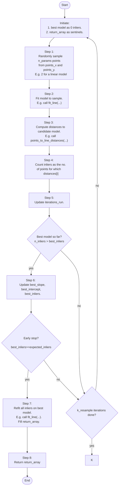

# Research Paper
* Name: Arsh Singh
* Semester: Spr 2026
* Topic: Random Sample Consensus (RANSAC) Algorithm

## Introduction
<!-- 
- What is the algorithm/datastructure?
- What is the problem it solves?
- Provide a brief history of the algorithm/datastructure. (make sure to cite sources)
- Provide an introduction to the rest of the paper. 
-->

The Algorithm that I want to focus on is called Random Sample Consesus (RANSAC). The method was introduced by Martin Fischler and Robert Bolles in 1981 [1]. It is a method for fitting a predetermined model to experimental data with sizeable number of outliers or noise.

<!-- Motivate the discussion with an example create a noisy line genarator over three different graphs with different but over lapping ranges of x -->
To motivate a good idea of the problem this algorithm solves, its usefulness and effectiveness, I will use a toy example to show how one of most popular fitting models - the least squares model is not robust to outliers.

For the sake of the following few paragraphs, assume that we are assigned the task of stitching the two graphs together and then deduce the true underlying model that created the data (apart from the noise). It is known that the following two graphs are built from the same linear model, but over different ranges of $x$ and are noisy with two possible kinds of errors: random noise (zero mean) and heavy-tailed noise (also mean zero). But there is no appreciable range of $x$ with only systematic bias. RANSAC assumes that within the data there are some clean points that lie within threshold distance of the correct model's prediction.

RANSAC inverts the logic of least squares: instead of fitting all the data first and cleaning up afterward, it starts with the smallest possible sample, finds a model, then recruits only the points that agree with it.

<!-- [Show example of location determination - the one in the paper.] -->
The original paper demonstrated the application of RANSAC in *location determination problem* in computer vision. Today, RANSAC (Random Sample Consensus) is one of the most widely used tools for outlier rejection and data fitting, particularly in 2-D image stitching and structure from motion. The method has now been applied to a wide array of other problems [2, 3, 4]. I will disuss these in the section [Applications](#application). 

The rest of the paper is organized as follows: 

In the next section, [Analysis of Algorithm/Datastructure](#analysis-of-algorithmdatastructure), I will present the theoretical analysis of the RANSAC algorithm tryting to fit a linear and a quadratic model. [Maybe: I will also generalize this to a k-neighbors classification problem.] I will present the time and space complexity in the case of the specified models. 

In the section [Empirical Analysis](#empirical-analysis), I will present the empirical run time of the methods I implement in Python [Maybe: and C]. I will do a comparative analysis based on the models and the three variables for RANSAC. 

In the section [Application](#application) I will take a deeper dive into the various applications of RANSAC. 

In the section [Implementation](#implementation) I will present code snippets of my final implementation [maybe C, else Python]. I willdo a walk through and present a commentary on my design choices.

In conlusion, I will present a [Summary](#summary) of my findings and lessons I learnt.

## Analysis of Algorithm/Datastructure 
<!-- 
Make sure to include the following:
 - Time Complexity
 - Space Complexity
 - General analysis of the algorithm/datastructure
 - [Linear model]
 - [Quadratic model]
 - [Classification in n groups]
-->

<!-- Formal Definition -->

### Algorithm
The RANSAC paradigm is more formally stated [1] as follows.

Given a model that requires a minimum of $n\_params$ data points to instantiate its free parameters, and two arrays $points\_x$ and $points\_y$ of $n\_points$ data points such that $n\_points \ge n\_params$, RANSAC proceeds as follows:

1. Randomly select a subset $S_1$ of $n\_params$ data points from $points\_x$ and $points\_y$ and instantiate the model. Use the instantiated model $M_1$ to determine the subset $S_1^*$ of points in $points\_x$ and $points\_y$ whose perpendicular distance from $M_1$ is within the threshold $t$. The array $S_1^*$ is called the consensus array of $S_1$.

2. If $|S_1^*| \ge expected\_inliers$, where $expected\_inliers$ is a threshold derived from the estimated outlier fraction $\epsilon$, use $S_1^*$ to compute a refined model $M_1^*$ using least squares over all consensus points. Return $M_1^*$ as the best model.

3. If $|S_1^*| < expected\_inliers$, randomly select a new subset $S_2$ and repeat the above process, tracking the consensus array with the largest size seen so far.

4. If, after $k\_resample$ trials, no consensus array of size $expected\_inliers$ or greater has been found, refit the model using the largest consensus array found across all trials. If no consensus array was found at all, terminate in failure.

### Time Complexity Analysis

Looking at the flow chart. For each of the $k$ iterations:

| Step | Description | Time Complexity of Step |
|:-|:-|:-|
| 1 | sample n_params points | $O(n\_params)$ |
| 2 | fit line to sample | $O(n\_params)$ |
| 3 | compute distances of each point to the model | $O(n\_points)$ |
| 4 | count inliers | $O(n\_points)$ |

The steps 3 and 4 are have dominant time complexity of $O(n\_points)$.

So the overall time complexity = $O(k \cdot n\_points)$

$k$ itself depends only on $\epsilon$ and $n\_params$ (minimum parameters to be estimated), not on $n\_points$. So the time complexity of the analysis is linear in $n\_points$. 

### Space Complexity

I only implement arrays. The rate limiting size is `n_points`. So the space complexity of RANSAC is $O(n\_points)$.

| Data Structure | Space Complexity |
|:-|:-|
|`distances` | $O(n\_points)$ |
|`points_x` | $O(n\_points)$  worst case all points are inliers |
|`points_y` | $O(n\_points)$ worst case all points are inliers |
|`idx` | $O(n\_points)$ Fisher-Yates index array |
|`sample_x` | $O(n\_params)$  constant |
|`sample_y` | $O(n\_params)$  constant |

## Empirical Analysis
<!-- 
- What is the empirical analysis?
- Provide specific examples / data.

HIGHLIGHTS:
1. Abstracting away from image complexities by using 2-D points instead of pixels. 
2. Keeping cartesian points also allows me to represent my analysis using simple and easy to interpret graphs.
3. 
-->

## RANSAC Parameters

RANSAC is governed by three parameters that jointly determine both the quality of the estimated model and the computational cost of finding it. These are the threshold distance $t$, the number of iterations $k$, and the expected inlier count $d$.

### Threshold distance $t$

The threshold $t$ defines the boundary between inliers and outliers. A point is classified as an inlier if its perpendicular distance from the candidate model falls below $t$. Setting $t$ too small causes RANSAC to reject points that are legitimate inliers corrupted by small measurement noise, starving the consensus set. Setting $t$ too large causes it to accept outliers as inliers, corrupting the consensus set from the other direction. In practice, $t$ is derived from the data itself rather than set in advance. Fischler and Bolles suggest setting $t$ at one or two standard deviations beyond the measured average residual error, that is $t = \bar{e} + \sigma$ or $t = \bar{e} + 2\sigma$, where $\bar{e}$ is the mean residual and $\sigma$ is its standard deviation computed over the full point set.

### Iteration count $k$

The iteration count $k$ controls how many independent random samples are drawn. Each sample of $n$ points defines a candidate model, and $k$ determines how thoroughly the space of candidate models is explored. The probability that at least one of the $k$ samples is drawn entirely from inliers — and therefore yields a good model — can be derived analytically. If $\epsilon$ is the outlier fraction and $n$ is the minimum sample size, then the probability of drawing a clean sample in a single trial is $(1 - \epsilon)^n$. The probability that all $k$ trials fail is therefore $[1 - (1-\epsilon)^n]^k$. Setting this equal to a desired failure probability $p$ and solving for $k$ gives:

$$k = \frac{\log(p)}{\log(1 - (1 - \epsilon)^n)}$$

This formula makes explicit the dependence of $k$ on the outlier fraction and the model complexity. As the outlier fraction grows or the minimum sample size increases, $k$ must grow rapidly to maintain the same confidence level.

Fischler and Bolles suggest a failure probability of $p = 0.01$, meaning RANSAC is given a 99 percent chance of finding at least one clean sample across all $k$ iterations. This is the standard practical choice in the literature. Substituting $p = 0.01$ into the formula above, the required number of iterations for line fitting where $n = 2$ grows rapidly with the outlier
fraction $\epsilon$:

| Outlier fraction $\epsilon$ | Required iterations $k$ at 99% confidence |
|---|---|
| 0.10 | 2 |
| 0.30 | 7 |
| 0.50 | 17 |
| 0.70 | 49 |
| 0.90 | 459 |

This exponential growth motivates the early stop parameter $d$ — at high outlier fractions, running all $k$ iterations is computationally expensive, and terminating early when a sufficiently good model is found provides significant practical savings.

### Expected inlier count $d$

The expected inlier count $d$ serves as an early stopping criterion. Once a candidate model achieves a consensus set of size at least $d$, the search terminates immediately without exhausting all $k$ iterations. The practical importance of $d$ is made clear by the table above — at an outlier fraction of 0.90, the required iteration count reaches 1163. In such cases, running all $k$ iterations every time is computationally expensive, and terminating as soon as a sufficiently good model is found provides significant savings. 

The parameter $d$ is typically set as a fraction of the total point count $N$, reflecting the expected proportion of inliers. For example, if the outlier fraction is expected to be at most 0.30, then $d = 0.70 \times N$ is a reasonable choice. Setting $d$ too conservatively — close to $N$ — causes RANSAC to always run all $k$ iterations, forgoing the computational savings. Setting it too aggressively — close to $n$, the minimum sample size — risks accepting a suboptimal model that happens to accumulate enough inliers by chance.

In practice $\epsilon$ is rarely known precisely. Three approaches are common. First, domain knowledge — if the feature matcher is known to produce roughly 30 percent false matches, set $\epsilon = 0.30$ and $d = 0.70 \times N$. Second, consistency between $k$ and $d$ — use the same $\epsilon$, ensuring the two parameters reflect a coherent assumption about the data. Third, a pilot run — run RANSAC once with a conservative $d$ such as $0.5 \times N$, observe how many inliers the best model finds, and use that count to calibrate $d$ for subsequent runs. 

The parameters $k$ and $d$ have opposing roles: $k$ is a safety net that pushes the iteration count up to guarantee confidence, while $d$ is an exit condition that pulls it down as soon as a good enough model is found. The actual number of iterations run sits somewhere between 1 and $k$, determined by how quickly a model exceeding $d$ inliers is found. Because both parameters depend on the same assumption about the data, the choice of $d$ should be consistent with the outlier fraction $\epsilon$ used to compute $k$. If $\epsilon$ is the estimated outlier fraction and $N$ is the total point count, then a principled choice is $d = (1 - \epsilon) \times N$. Thus of the three apporaches described above, the second approach is the most principled and is the one adopted in this project.

### Estimating the Outlier Fraction $\epsilon$

Choosing a good value for $\epsilon$ is more subtle than it appears because the problem is circular — $\epsilon$ is needed to set $k$ and $d$, but the true outlier fraction is only known after the inliers have been identified. Three data-driven approaches are common in practice [2, 4]. 

The first uses the residual distribution: fit a rough model to all the data using least squares, compute the residuals, and treat points with residuals beyond $\bar{e} + 2\sigma$ as likely outliers. The fraction of such points estimates $\epsilon$. The second approach plots a histogram of residuals from the least squares fit. A dataset with outliers typically shows a bimodal distribution — a tight cluster of inlier residuals near zero and a diffuse spread of outlier residuals further out. The fraction in the diffuse spread gives $\epsilon$. The third approach uses iterative refinement: start with a conservative overestimate such as $\epsilon = 0.5$, run RANSAC, observe the inlier fraction of the best model, update $\epsilon$, and rerun until convergence. 

In this project the second approach is used — $\epsilon$ is known exactly because the data is generated synthetically with a controlled outlier fraction. This allows a direct empirical verification — the theoretical $k$ derived from the formula can be compared against the number of iterations actually needed to recover the true model, providing a clean test of how well the analytical result predicts practical performance.

### Parameter Estimation Helper Functions

Rather than requiring the caller to supply $\epsilon$, $k$, $d$, and $t$ directly, four helper functions are provided to estimate these parameters from the data itself. 

`estimate_epsilon` fits a least squares line to all points, computes the residuals, and returns the fraction of points whose residual exceeds $\bar{e} + 2\sigma$ as an estimate of the outlier fraction $\epsilon$. 

`compute_t` uses the same residual distribution to set the inlier threshold as $t = \bar{e} + 2\sigma$, consistent with the recommendation of Fischler and Bolles [1]. 

`compute_k` applies the analytical formula $k = \lceil \log(p) / \log(1 - (1 - \epsilon)^n) \rceil$ with a default failure probability of $p = 0.01$, returning the iteration count rounded up to the nearest integer. 

`compute_d` sets the expected inlier count as $d = \lfloor (1 - \epsilon) \times N \rfloor$, ensuring consistency with the same $\epsilon$ used to compute $k$. The caller therefore only needs to provide the raw point data and the minimum sample size $n$, and the parameter estimation is handled automatically. 

This design also makes the relationship between $\epsilon$, $k$, $d$, and $t$ explicit and testable — each helper is a small pure function that can be verified independently, consistent with the test-driven development approach used throughout this project. In the empirical analysis, the true $\epsilon$ used to generate the synthetic data is compared against the value returned by `estimate_epsilon`, providing a direct measure of how accurately the helper recovers the outlier fraction under varying noise conditions.

## Application
<!-- 
- What is the algorithm/datastructure used for?
- Provide specific examples
- Why is it useful / used in that field area?
- Make sure to provide sources for your information.
-->

RANSAC (Random Sample Consensus) is one of the most widely used tools for outlier rejection and data fitting, particularly in image stitching and structure from motion. Allow me to motivate its need and define image stitching. 

Many real-world computer vision tasks require a field of view far wider than what a single camera can capture. Many smart-phone owners may be familiar with the features of camera such as panoramic imaged, and video stabilization. Image stitching is also needed in industrial applications such as satellite and aerial imaging, medical imaging, autonomous navigation, and augmented reality — anywhere a spatial context is needed that a single image cannot provide.

In image stitching, the goal is to align two or more overlapping images by estimating a geometric transformation — such as a homography — that maps points from one image to corresponding points in another. This requires finding reliable feature correspondences between images. However, automated feature matching is inherently noisy: many matched point pairs will be incorrect, either due to repetitive textures, illumination differences etc. These incorrect matches, or outliers, is exactly what are handled gracefully and efficiently by RANSAC.

## Implementation
<!-- 
- What language did you use?
- What libraries did you use?
- What were the challenges you faced?
- Provide key points of the algorithm/datastructure implementation, discuss the code.
- If you found code in another language, and then implemented in your own language that is fine - but make sure to document that.

HIGHLIGHTS:

1. Abstracting away from image complexities by using 2-D points instead of pixels. 
2. Keeping cartesian points also allows me to represent my analysis using simple and easy to interpret graphs.
3.  
-->

Salient Design Decisions:

Python:
* C correspondence:
  * separate `data_x` and `data_y` arrays
  * functions that modify these in-place
  * all functions return -1 for error and 0 for success 
  * use only rand() 
  * do not use any other python packages - create gaussian noise manually using Box-Muller[5]
  * For random sampling I am using Fisher-Yates sampling [6]
  * ransac resampling refitting on inliers is dones by moving inliers to the front, changing the user passed list
  * The in-place compacting was replaced with new lists (not C-correspondent) while looking for a bug. Finally the bug was that the I was refitting the model inside the loop.  

* Separate lists of x and y rather than tuples for mutability.
* `return_array` layout for ransac() with an eye for a future C struct
* Different kind of noise as separate functions to allow testing the efficacy of RANSAC with different kind of errors. 
* Using Box-Muller for gaussian noise [5].
* Why laplace noise?
  * Gaussian:  tails decay as exp(-x²)
  * Laplace:   tails decay as exp(-|x|), slower decay and heavier tails
  * The Laplace distribution looks like two exponential curves back to back, centered at a mean (0 in case of noise).
  * noise drawn from Laplace distribution has a higher probability of generating points far from the mean than Gaussian with the same scale. This makes it a good model for measurement errors that occasionally produce large deviations — more realistic than pure Gaussian.
* `fit_line` uses least squares - write formulae
* `points_to_line_distances` uses geometric (perpendicular) distance - write formula
* In RANSAC The refit is a post-processing step, not part of the RANSAC iteration — cite Fischler and Bolles
* All tests of RANSAC fail sometimes (1 in 100 times as designed), since RANSAC is a stochastic, randomized good-enough model.

### Least Squares Line Fitting

Given $n$ points $(x_i, y_i)$, the slope $m$ and intercept $b$ of the best fitting line $y = mx + b$ are estimated by minimizing the sum of squared residuals. The closed form solution is:

$$m = \frac{n \sum x_i y_i - \sum x_i \sum y_i}{n \sum x_i^2 - \left(\sum x_i\right)^2}$$

$$b = \frac{\sum y_i - m \sum x_i}{n}$$

The denominator $n \sum x_i^2 - \left(\sum x_i\right)^2$ is zero when all $x_i$ are equal, corresponding to a vertical line whose slope is undefined. This case is detected and rejected as an error in the implementation.

### Perpendicular Distance from a Point to a Line

Given a line defined by slope $m$ and intercept $b$, written in general form as $mx - y + b = 0$, the perpendicular distance from a point $(x_i, y_i)$ to the line is:

$$d_i = \frac{|m x_i - y_i + b|}{\sqrt{1 + m^2}}$$

This is the geometric distance — the length of the shortest path from the point to the line, which is always perpendicular to it. The absolute value ensures the distance is non-negative regardless of which side of the line the point lies on. RANSAC uses this distance to classify each point as an inlier if $d_i < t$, or an outlier otherwise.

### Parameter Estimation Helper Functions

Rather than requiring the caller to supply $\epsilon$, $k$, $d$, and $t$ directly, four helper functions are provided to estimate these parameters from the data itself. 

`estimate_epsilon` fits a least squares line to all points, computes the residuals, and returns the fraction of points whose residual exceeds $\bar{e} + 2\sigma$ as an estimate of the outlier fraction $\epsilon$. 

`compute_t` uses the same residual distribution to set the inlier threshold as $t = \bar{e} + 2\sigma$, consistent with the recommendation of Fischler and Bolles [1]. 

`compute_k` applies the analytical formula $k = \lceil \log(p) / \log(1 - (1 - \epsilon)^n) \rceil$ with a default failure probability of $p = 0.01$, returning the iteration count rounded up to the nearest integer. 

`compute_d` sets the expected inlier count as $d = \lfloor (1 - \epsilon) \times N \rfloor$, ensuring consistency with the same $\epsilon$ used to compute $k$. The caller therefore only needs to provide the raw point data and the minimum sample size $n$, and the parameter estimation is handled automatically. 

This design also makes the relationship between $\epsilon$, $k$, $d$, and $t$ explicit and testable — each helper is a small pure function that can be verified independently, consistent with the test-driven development approach used throughout this project. In the empirical analysis, the true $\epsilon$ used to generate the synthetic data is compared against the value returned by `estimate_epsilon`, providing a direct measure of how accurately the helper recovers the outlier fraction under varying noise conditions.

## Summary
<!-- 
- Provide a summary of your findings
- What did you learn?
-->

## LLM Use Disclosure 
I did not any LLM to write any part of the code. I implemented my codes using pseudocodes presented in the texts in the reference section. I used MS Word for checking the report for syntax and grammar.

Claude: I used Calude for planning a 4-week time-line. I also used Claude to add doc strings at the end. I also used Clause for trouble shooting when I was unable to figure a bug in helper functions for testing which caused persistent test failures.

Google Gemini: I used Google Gemini to look up many unknown terms when I encountered them in the text books.

## References

[1] Fischler, M. A. and Bolles, R. C. 1981. Random sample consensus: a paradigm for model fitting with applications to image analysis and automated cartography. Commun. ACM 24, 6 (June 1981), 381–395. https://doi.org/10.1145/358669.358692.

[2] Szeliski, R. 2022. Computer Vision: Algorithms and Applications (2nd ed.). Springer. ISBN 978-3-030-34371-2. https://doi.org/10.1007/978-3-030-34372-9.

[3] Davies, E. R. 2012. Computer and Machine Vision: Theory, Algorithms, Practicalities (4th ed.). Academic Press. ISBN 978-0-12-386908-1.

[4] Richard Hartley and Andrew Zisserman. 2004. Multiple View Geometry in Computer Vision. Cambridge University Press.

[5] Box, G. E. P. and Muller, M. E. 1958. A note on the generation of random normal deviates. The Annals of Mathematical Statistics 29, 2, 610–611.

[6] Durstenfeld, R. 1964. Algorithm 235: Random permutation. Communications of the ACM 7, 7, 420.

<!-- Time Line
Days 1-3  (now-Apr 5):   finish generate.py + model.py
Days 4-6  (Apr 6-8):     ransac.py + evaluate.py
Days 7-9  (Apr 9-11):    end-to-end test + experiments
Days 10-12(Apr 12-14):   empirical analysis + plots
Days 13-15(Apr 15-17):   report writing + cleanup

Good to do:
Days 13-15(Apr 18-20):   Translate to C
Days 10-12(Apr 21-):   empirical analysis + plots
Days 13-15(Apr 15-17):   report writing + cleanup

-->